# RISE Media
RISE media is a global digital media agency with offices in London, New York, Sydney & Toronto. 

Across the world, SMBs and enterprises are in the process of undergoing a digital transformation, primarily driven by Covid-19. With the ability to 'work from anywhere', businesses are looking for innovative strategies that help their brand grow by connecting with their customers on a human and emotional level.
  

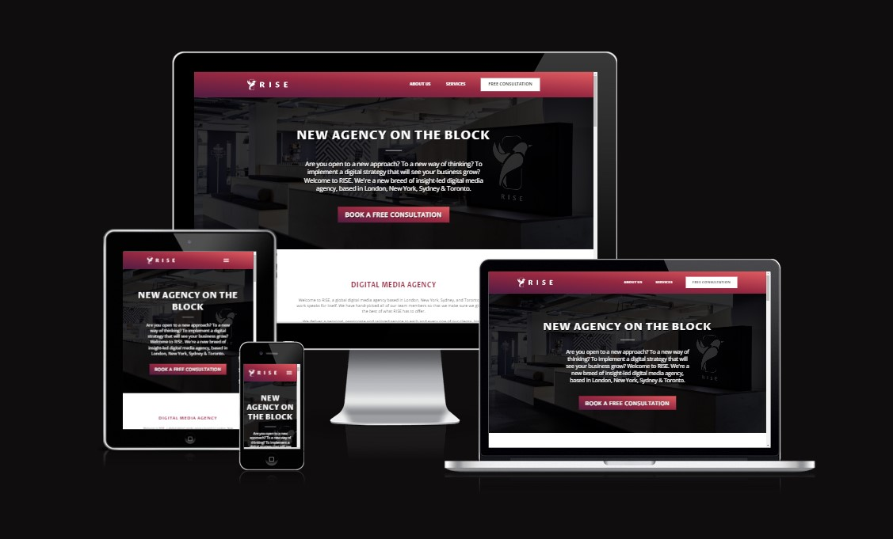

 

## Contents

[Planning & Development](https://github.com/lewis-worsley/digital-media-agency/blob/main/README.md#planning--development)

[Features](https://github.com/lewis-worsley/digital-media-agency/blob/main/README.md#features)

[Testing](https://github.com/lewis-worsley/digital-media-agency/blob/main/README.md#testing)

[Deployment](https://github.com/lewis-worsley/digital-media-agency/blob/main/README.md#deployment)

[Languages](https://github.com/lewis-worsley/digital-media-agency/blob/main/README.md#languages)

[Software](https://github.com/lewis-worsley/digital-media-agency/blob/main/README.md#software)

[Media](https://github.com/lewis-worsley/digital-media-agency/blob/main/README.md#media)

[Credits](https://github.com/lewis-worsley/digital-media-agency/blob/main/README.md#credits)

 

## Planning & Development

RISE Media has been established to help companies with their digital transformations by providing businesses the opportunitiy to integrate an outsourced digital media agency with their marketing, UX and web-development plans. 
 

RISE Media is focused on being customer-centric and helping organisations their objectives and goals.

 

### Site Objective

As a B2B company, the site is geared towards catering for professionals who will be browsing the website during their day-to-day work activities.  

It's a services-orientated lead generation website, with the aim of converting as many visitors into leads, quality leads. Alternatively, users can call or email the company.   

Prices are not shared online and services are not sold online due to the complex nature of delivering bespoke services, as RISE Media like to tailor their services, expertise and offer that will be of benefit to the customer. There is no one-size-fits-all.   

In summary, the site is to:

- show a brief, relevant intro message that is of relevance and value on the homepage, without the user needing to scroll to understand what type of business RISE Media is
- communicate the brand's mission and vision
- highlight the services available
- provide easy navigation
- showcase that the company is a global media agency
- make it accessible for all users
- provide com#pany contact details on all pages
- give users the ability to submit a form to express their interest in the free consultation offer

 

### Target Audience

The website is designed to attract higher seniority levels, those who have the ability to affect business decisions and buying, such as CTOs, Marketing Directors, Head of IT etc.

Ideally, users visiting the website are professionals whom are employed by a company:

- Marketing Managers and higher
- UX Managers and higher
- Software Development Managers and higher
- Owners, CEOs, CTOs, CFOs for startups are welcome

Users with these professions will be interested in the services that RISE Media have to offer. In Summary, it is for users who have an interest in the following services:

- Social Media Marketing
- SEO & PPC Management
- Remarketing Ads
- Television Advertising
- Web Design & Management

RISE Media can offer a full service or complementary services to support the client's inhouse team, whether that be marketing, UX, development or a combination.

 

### Prototype

The desktop and mobile prototypes for RISE Media were designed in 2021 using Adobe software. Not every feature seen in the prototype have been replicated on the current version of the website, such as case studies and international office locations etc.  

Future development: the website would develop and publish the respective pages when appropriate, for example, when RISE Media have produced their first case study with a client. The service pages would be the next priority of development for RISE Media.
 
 
<strong>Desktop Prototype</strong> 

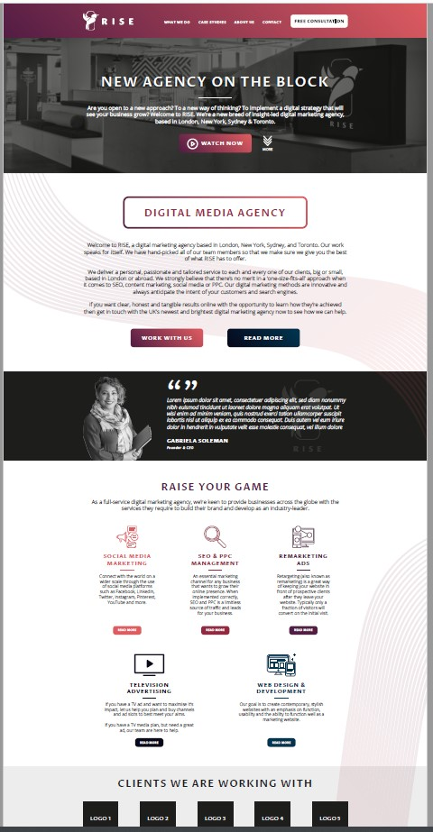
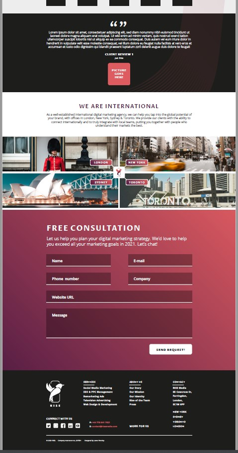 
 
<strong>Mobile Prototype</strong>
 
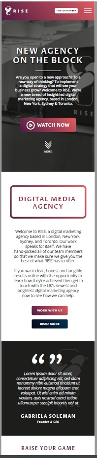
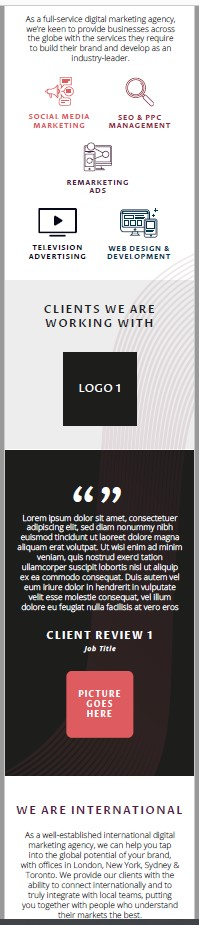
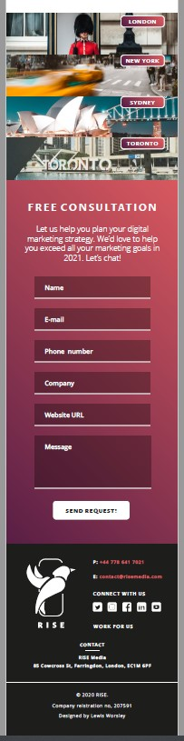

 

### Colour Scheme

The brand has a five colour palette, and this is supported with two gradients (45 degree angle from bottom left to top right).

- Pink-red: #E05B60
- Burgundy: #962841
- Purple: #531C44
- Mid Blue: #003551
- Dark Blue: 07081A

 

#### Gradient Violet

These three colours combine to create Gradient Violet:

- Pink-red: #E05B60
- Burgundy: #962841
- Purple: #531C44

It starts with Purple, followed by Burgundy, and ending with Pink-red.

 

#### Gradient Blue

These two colours combine to create Gradient Blue:

- Mid Blue: #003551
- Dark Blue: 07081A

It starts with Dark Blue, ending with Mid Blue. 
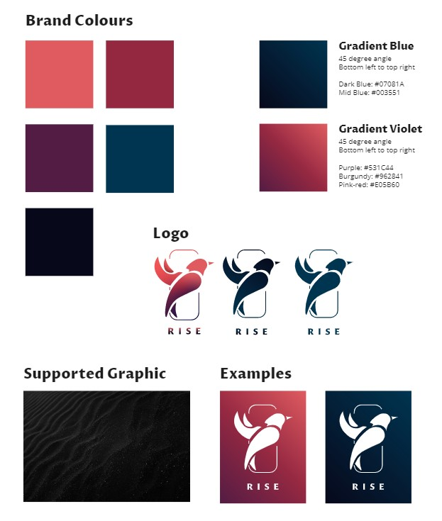

 

### Typography

There are two primary fonts used on the website: 

 - Proza Libre for headings
 - Open Sans for paragraph styles

 The fonts are imported to the stylesheet via Google fonts. 
 
 The social media icons that are located in the footer are provided from Font Awesome via a script

 

## Features

All of the contents and features is hosted on one page: homepage.

### Existing Features

To evaluate the website, the structure can be split into six sections:

#### Navigation Bar

- The navigation supports the brand logo (which upon being clicked returns the user to the homepage) and brand colour (3 colour gradient)
- Supporting the logo in the navigation bar, is links to About Us (aka, What We Do), Services (aka, Raise Your Game) and Free Consultation form
- Responsive across desktop, tablet, and mobile, however the following links are hidden in the nav bar once certain parameters are met regarding width:
    - 799px and less: About Us, Services, and Free Consultation links are hidden are located in the hamburger menu
- The site incorporates a sticky navigation bar to make it easy for users to navigate on the website
- Hovering over the Free Consultation brings a little bit of interactivity by moving the button up on the Y axis
- In the hamburger menu, all unique styling attributes that was applied before is removed and all links are given equal styling - this helps prevent the confusion for the user as only the link they're hovering over will change style
- In the hamburger menu, the last list element, in this case 'FREE CONSULTATION', sports a box-shadow to add depth, which helps to seperate the navbar from the page contents

<strong>Normal state at 800px and greater</strong> 
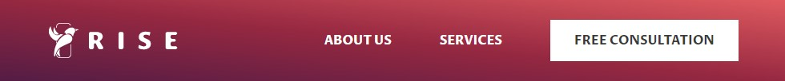 
 
<strong>Hover state at 800px and greater</strong> 
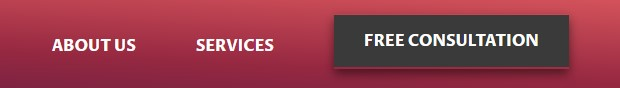 
 
<strong>Hamburger state at 799px and less</strong> 
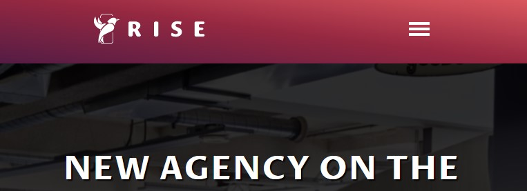 
 
<strong>Hamburger menu open</strong> 
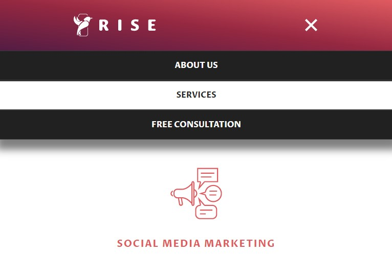 

 

#### Hero Image section

- The image in the background features a modern looking office to support the brand's forward thinking business model
- All elements have been made bigger than the rest of the homepage to draw the user's attention to the brand's opening heading and message. It's trying to push users to booking a free consultation
- As a consequence of the elements being made bigger for desktop screens, the respective elements reduce in size as media screens get smaller to ensure the hero image sections fits onto screen without scrolling

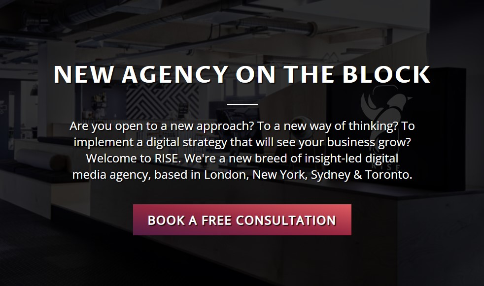

 

#### About Us (aka What We Do) section

- RISE Media is a B2B company, therefore a short summary of who RISE Media is and what they do is essential to informing the user of the company's services and capabilties
- The user is presented with two buttons: 'WORK WITH US' which takes the user to the form section and; 'FIND OUT MORE' which takes the user to find RISE Media's services
- At 690px and less, the 'FIND OUT MORE' drops underneath the 'WORK WITH US' button to ensure there is adequate space between elements and edge of screen

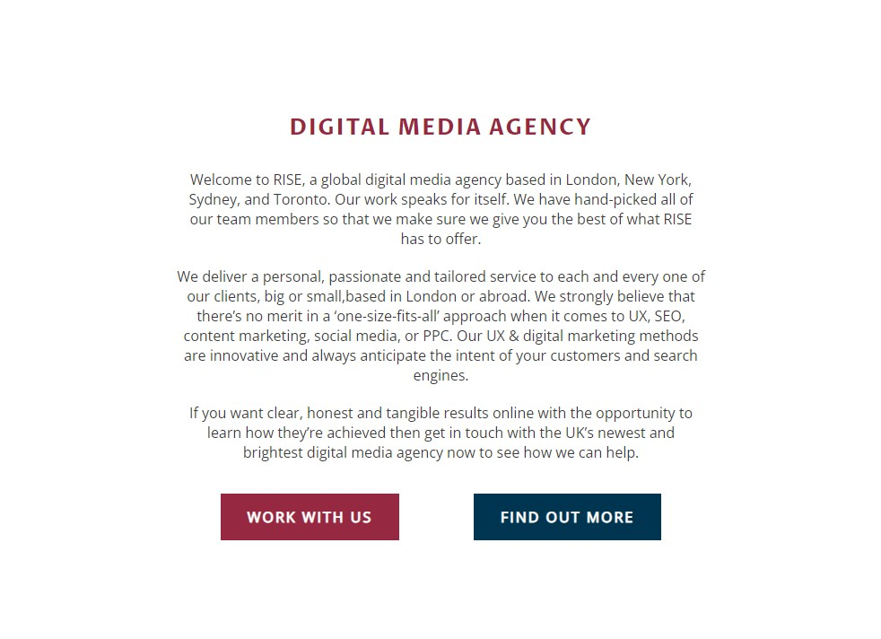

 

#### Quote section

- Positioning the founder onto the homepage helps to promote a thought leadership position and evoke a human response - human to human interaction helps to forge bonds and emotions. It puts a name to a face and is designed to make the user feel welcome onto RISE Media's website
- At 1200px and less, the image of the founder is hidden to make space for the smaller screen
- At 900px and less, the background logo is hidden to focus the user attention on the text for the smaller screen 
- To highlight it's a quote, the quotation marks have been emphasised by making the font-size greater than the other elements in the section
- There is no heading in the section because it doesn't justify one
- All elements, excluding image of the founder and logo, remain at the same size to highlight that the quote section is a standalone feature on the homepage

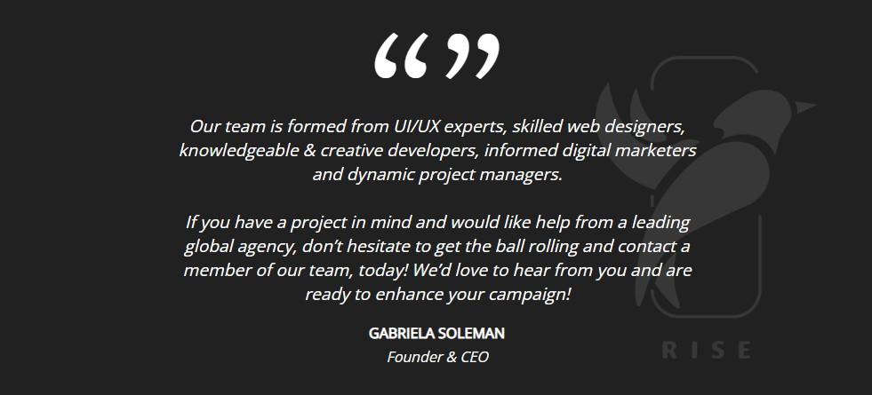

 

#### Services (aka Raise Your Game) section

- The top row with three columns seperates into two columns once 1450px width is met, and at 1000x width it collapses to one column. This ensures there is adequate spacing between all five mini-sections and edge of screen
- The five services are seperated by colour to help the user to quickly distinguish between the different services on offer from RISE Media. The elements affected are the icons, heading, horizontal line, and call-to-action button.
- Icons are used to support the titles and help the visitor to easily identify what services we RISE Media have to offer
- A brief description of each service and use of colour to differentiate between the services gives the user enough information to process without feeling overwhelmed

For future development: none of the buttons in this section direct the user elsewhere on the website. At the moment, the buttons are there for presentation purposes. However, once the appropriate services pages are added onto the website, the buttons will redirect the user to the respective service page they've requested to see.

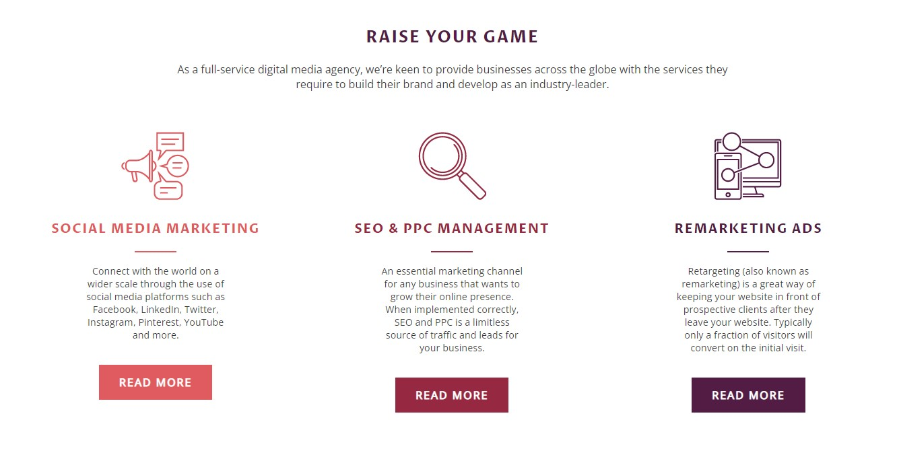
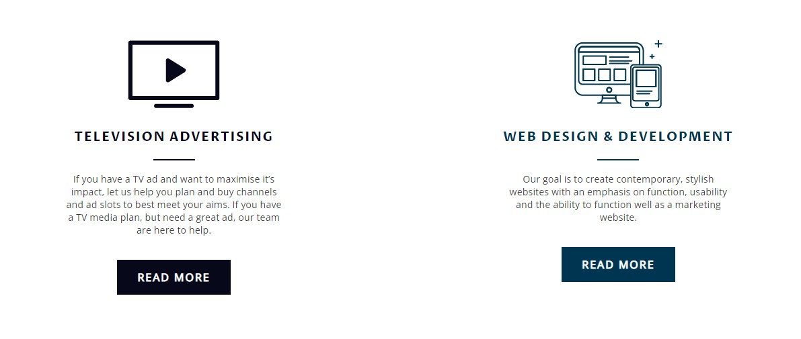

 

#### Footer

- The footer indicates the end of the page - this would be replicated on every page on the website.
- Social media icons (provided by Font Awesome) are included on the footer to encourage the visitor to engage with the brand. RISE Media social platforms will provide extra value and content and act as additional touchpoints with the visitor
- For accessibilily, each social link has an aria-label attribute
- When a user clicks on one of the social media icons, the browser redirects the visitor to a new tab. This prevents users from leaving the website
- The company's telephone number and email address is provided to give visitors the opportunity to reach out to RISE Media. The font-color is changed to burgundy to catch the user's eye and highlight they're call-to-action links
- The company details have the appropriate telephone and email links to make user experience friendly. Creating a sense of 'ease-of-use' on the website will evoke positive emotions and help encourage visitors to communicate with the brand

For future development: the footer is to include links to high-priorty pages and office locations.

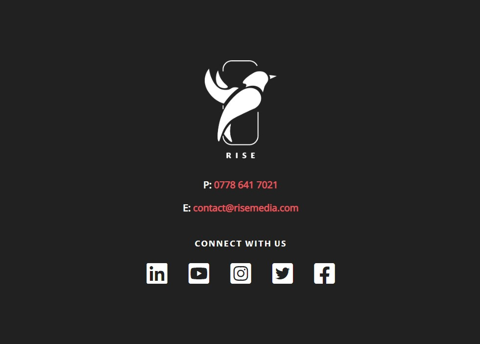

 

## Testing

Throughout the design of the website, but more so after the structure and contents of the page was added, Google Dev-tools was used extensively to validate new ideas, fix errors, unearth solutions, and ensure consistency with the design and user experience across various devices by ensuring the website was responsive.

 

### Testing on devices

During development of the website, the code was written and tested on HP EliteBook 840 G5 14". 

Google Dev-tools was used extensively throughout the process, as it provides instant feedback on appearence and responsivity across elements and dimensions.

After development, the website has been tested on the following devices:

- HP EliteBook 840 G5 14" - Chrome and Microsoft Edge
- LG 21.5" monitor 
- iPhone XS Max - Chrome and Safari
- Fire (Amazon) HD 8" Tablet - 8th Generation - Amazon Silk

<strong>HP EliteBook 840 G5 14" - using Google Device Toolbar</strong>
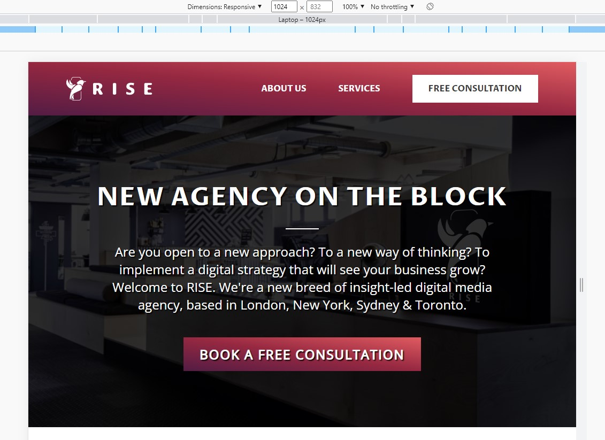
 
 
<strong>Fire HD 8" Tablet - 8th Generation</strong> 
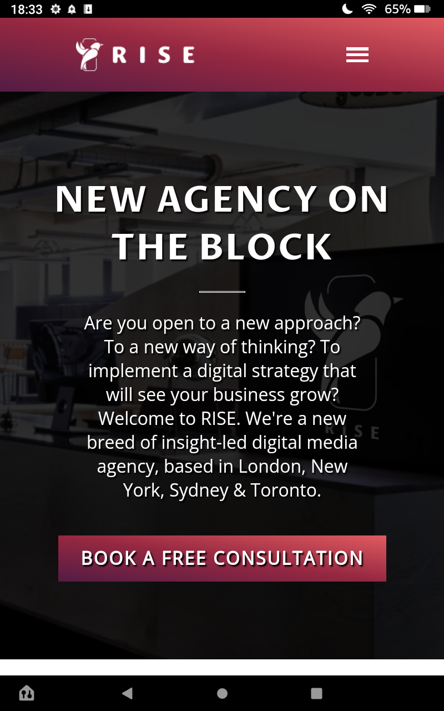
 
 
<strong>iPhone XS Max</strong> 
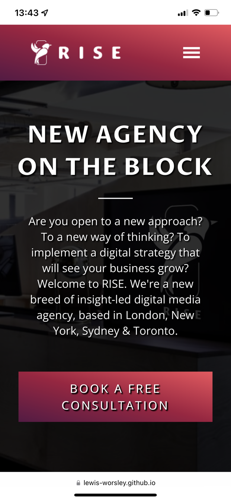
 

Noted for future development:

- On hover, the navbar button performs as expected, but there is a tiny zone where it transforms, however it does not change color as expected. It's not a major issue, other than a tiny annoyance
- On iPhone XS Max, Safari, the header colour doesn't cover all of the top, there is a small bit of white spacing left exposed
- On mobile, when scrolling back to the top, because of the 'bounce' effect, some of the background image is exposed without a black transparent layer over it
- On iPhone XS Max, Safari, it appears the submission button adopts a different style to the default one which is seen on desktop

 

### Testing links

Results:

- Each link on the navbar works as expected, including the hamburger menu
- The hero section button performs as expected
- The 'ABOUT US' section buttons perform as expected
- The 'SERVICES' section buttons perform as expected, however, it must be noted that the links don't go anywhere. This is because the respective pages for those links have not been created. For future development, the links will work as expected once the pages are established and live
- Each input on the form section works as expected and upon submission the form takes the user to https://formdump.codeinstitute.net/
- The telephone and email links in the footer work as expected 
- The social media icons in the footer work as expected

 

### Validator Testing

The three websites used to validate the code are:

- https://validator.w3.org/
- https://jigsaw.w3.org/css-validator/

For accessibility, the following websites and extensions were used:

- WCAG Contrast Checker
- Lighthouse

 

#### HTML Validator

Errors discovered: 
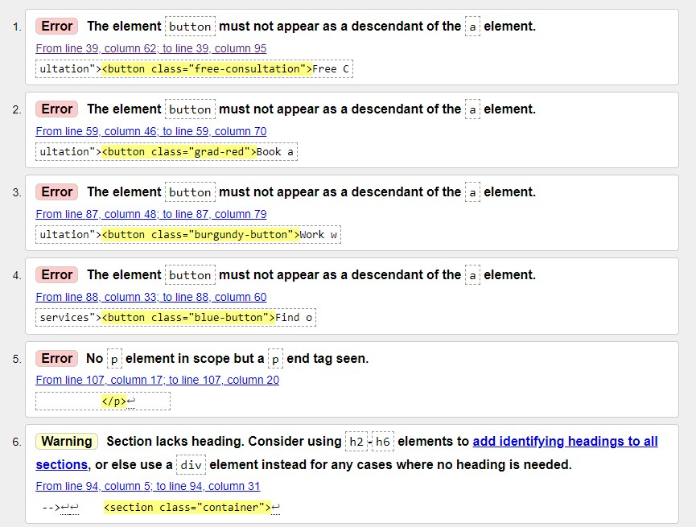
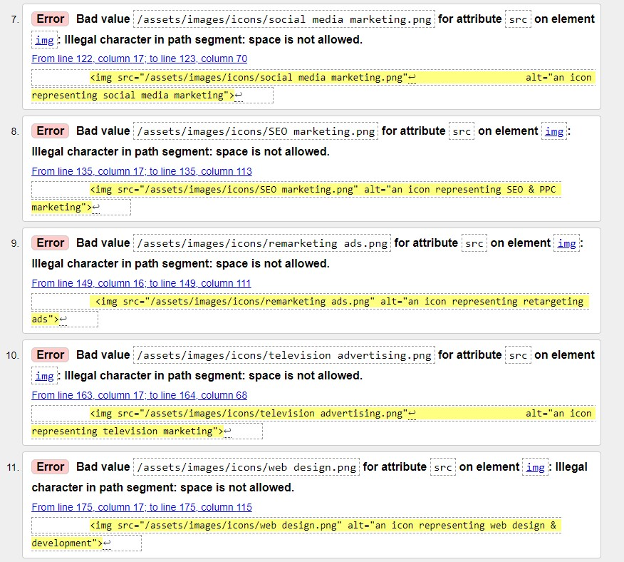
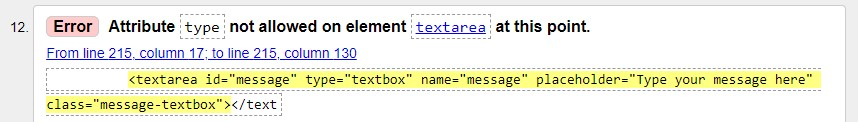 

 

Additional error discovered after integrating the hamburger menu onto the navbar
 
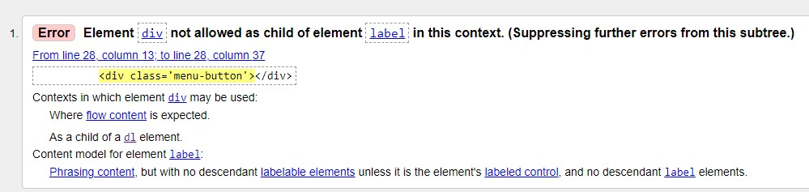

 

Errors fixed: 
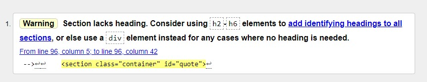

 

- Whilst the remaining issues were able to be fixed (excluding the additional error), the warning still remains. In this instance, the quote section does not need no heading elements due to no hierarchy of importance. It is a standalone section which conveys only one message: the Founder's thoughts.

Regarding the additional error reported (div not allowed as child of element...), the code for the hamburger performs as expected and in this case and in this context the hamburger menu behaves as expected, each links works and is responsive.

 

#### CSS Validator
Website used to validate CSS code: https://jigsaw.w3.org/css-validator/

Errors discovered: 
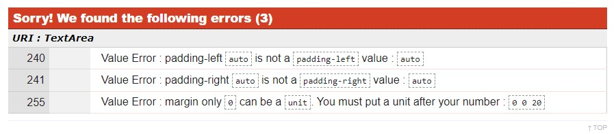
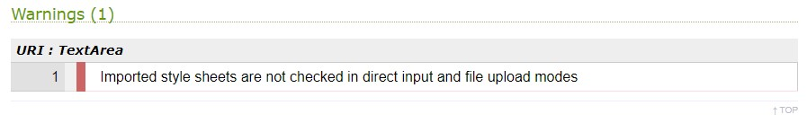

Errors fixed: 
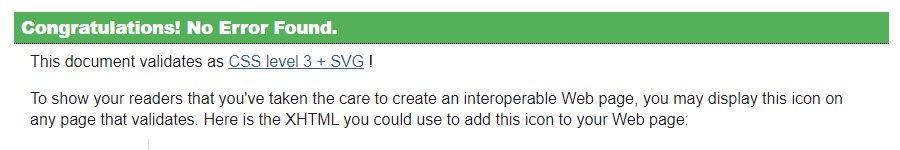 

- The latest version of the CSS stylesheet reported no errors

 

#### WCAG Contrast Checker

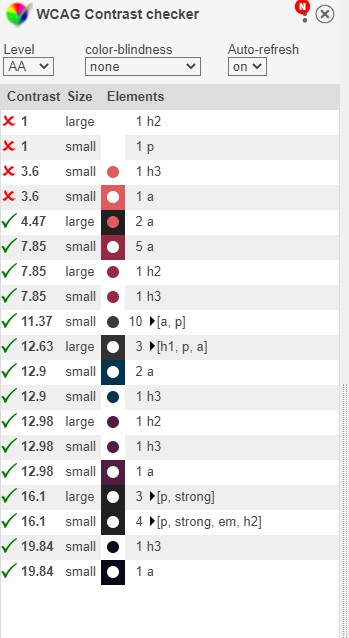 
It's reported that there are four contrasting errors:

- Two of the errors are located in the services section regarding Social Media Marketing. However, the image provided below show there is no visibility issue  and reading difficulty as there is a contrast between foreground and background colour

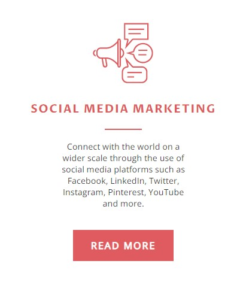 

- The other two are located in the form section. The h2 and p element have a white foreground colour against a gradient background. The example below shows there are no issues with visibility 

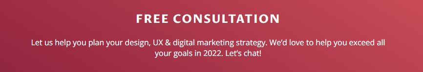 

 

#### Lighthouse

Lighthouse has reported extemely positive metrics (see graphic below) with scores ranging from 90 to 100. The results are:

- Performance: 100
- Accessibility: 97
- Best practises: 100
- SEO: 90

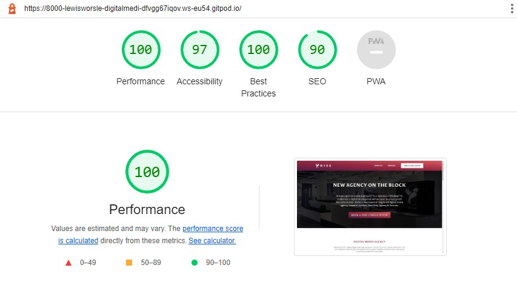 

## Deployments

The site was deployed to GitHub pages. The steps to deploy are as follows:

- In the GitHub repository, navigate to the Settings tab
- From the source section drop-down menu, select the Main Branch
- Once the master branch has been selected, the page will be automatically refreshed with the word 'active' displayed in a green colour at the end of the sentence (next to last duration when published)
The live link can be found here - https://lewis-worsley.github.io/digital-media-agency/

## Languages

The coding languages used:

- HTML
- CSS

 

## Software

The design for RISE Media was created via the Adobe Creative Cloud Suite; more specifically I used:

- Abobe Photoshop
- Adobe InDesign
- Adobe Illustrator

Through using these three tools, I was able to design the logo, create imagery, design the website, and compress web images by either reducing image size or quality via export.

 

## Media

The logo and icons for RISE Media was designed by myself, Lewis Worsley.

 

## Credits

To help bring this project to life, the following deserve recognition:

 

### Content

The CSS code to transform the navbar button on hover was provided by https://developer.mozilla.org/en-US/docs/Web/CSS/transform-function/translateY

- The CSS code to integrate the hamburger menu onto the navbar was provided by https://alvarotrigo.com/blog/hamburger-menu-css/#:~:text=What%20Is%20A%20Hamburger%20Menu,top%20of%20the%20main%20content > 1 Responsive CSS Hamburger Menu - CSS only

- The 3-colour-gradient for the brand was provided by https://mycolor.space/

- The CSS structure for the hero section was inspired by the Code Institute's Coders Coffeehouse

- The background hero image of the office was found and saved via search on Google Images https://www.linkedin.com/company/goodstuff-communications. The company logo was removed and the RISE Media logo was inserted via Photoshop

- The CSS code to achieve a gradient background was provided by https://www.w3schools.com/

- To specify a minimum font-size for responsive design - especially for mobile - a user from Stack Overflow in a public open forum https://stackoverflow.com/questions/23984629/how-to-set-min-font-size-in-css provided CSS code to help achieve this

- Change the color of the placeholder text of an input field was provided by https://www.w3schools.com/

- Font pairing (Proza Libre and Open Sans) for RISE Media was inspired by https://www.fontpair.co/

- Social media text icons located in the footer were sourced from https://fontawesome.com/

 

### Thanks

- Richard Wells
    - His mentorship and time have been of utmost value to me progressing this project along. I showed my concept of RISE Media to Richard on our first call and he gave me the encouragement and belief that I could execute the design. His easy-going and laid-back persona reminds me of myself, which is why I feel our meetings have been valuable and fun. 