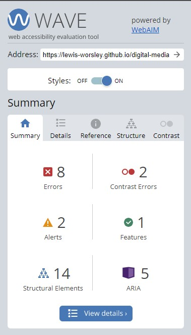
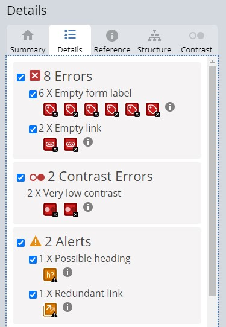

# RISE Media
RISE media is a global digital media agency with offices in London, New York, Sydney & Toronto. 

Across the world, SMBs and enterprises are in the process of undergoing a digital transformation, primarily driven by Covid-19. With the ability to 'work from anywhere', businesses are looking for innovative strategies that help their brand grow by connecting with their customers on a human and emotional level.

The website is designed to attract higher seniority levels, those who have the ability to affect business decisions and buying, such as CTOs, Marketing Directors, Head of IT etc.

## Contents

## Features

All of the contents and features is hosted on one page: homepage.

### Existing Features

To evaluate the website, the structure can be split into six sections:

#### Navigation Bar

#### Hero Image section

#### About Us (aka What We Do) section

#### Quote section

#### Services (aka Raise Your Game) section

#### Footer

## Testing

Throughout the design of the website, but more so after the structure and contents of the page was added, Google Dev-tools was used extensively to validate new ideas, fix errors, unearth solutions, and ensure consistency with the design and user experience across various devices by ensuring the website was responsive.

### Validator Testing

The two websites used to validate the code:
- https://validator.w3.org/
- https://jigsaw.w3.org/css-validator/

#### HTML Validator

Errors discovered: 

Errors fixed: 

Whilst the remaining issues were able to be fixed, the warning still remains. 

In this instance, the quote section does not need no heading elements due to no hierarchy of importance. It is a standalone section which conveys only one message: the Founder's thoughts.

#### CSS Validator

Errors discovered: 

Errors fixed: 

#### WAVE (Web Accesssibility Evaluation Tool)

Errors discovered:  

Errors fixed:  

## Deployments

The site was deployed to GitHub pages. The steps to deploy are as follows:
- In the GitHub repository, navigate to the Settings tab
- From the source section drop-down menu, select the Main Branch
- Once the master branch has been selected, the page will be automatically refreshed with the word 'active' displayed in a green colour at the end of the sentence (next to last duration when published)
The live link can be found here - https://lewis-worsley.github.io/digital-media-agency/

## Languages

The coding languages used
- HTML
- CSS

## Software

The design for RISE Media was created via the Adobe Creative Cloud Suite; more specifically I used:
- Abobe Photoshop
- Adobe InDesign
- Adobe Illustrator

Through using these three tools, I was able to design the logo, create imagery, design the website, and compress web images by either reducing image size or quality via export.

## Media

The logo and icons for RISE Media was designed by myself, Lewis Worsley.

## Credits

- The 3-colour-gradient for the brand was provided by https://mycolor.space/

- The CSS structure for the hero section was inspired by the Code Institute's Coders Coffeehouse

- The CSS code to achieve a gradient background was provided by https://www.w3schools.com/

- To specify a minimum font-size for responsive design - especially for mobile - a user from Stack Overflow in a public open forum https://stackoverflow.com/questions/23984629/how-to-set-min-font-size-in-css provided CSS code to help achieve this

- Change the color of the placeholder text of an input field was provided by https://www.w3schools.com/

- Font pairing (Proza Libre and Open Sans) for RISE Media was inspired by https://www.fontpair.co/

- Social media text icons located in the footer were sourced from https://fontawesome.com/